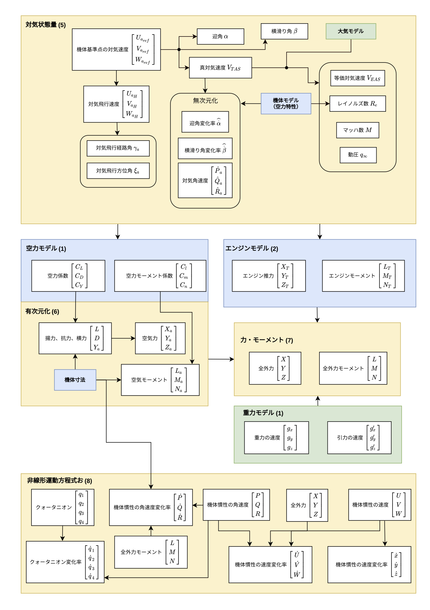

# space-rocket-controller-variable-initialization

space-rocket-controller-variable-initialization は、宇宙ロケットのオンボーディング環境においてリアルタイムで初期値演算を行うマイクロサービスです。  

## 演算項目

本マイクロサービスでは、以下の項目における初期値演算が行われます。

* t_se：方向余弦行列（機体重心位置の結果）
* t_eh：方向余弦行列（機体重心位置の結果）
* t_hb：方向余弦行列（機体姿勢の結果）
* t_sb：t_se、t_eh、t_hbの結果
* q：クオータニオンの結果
* xyz_s：機体重心のECI座標結果
* pqr：機体慣性の角速度の結果
* uvw：機体慣性の速度の結果  
  
    
    
該当箇所は、initializer.py の以下の部分です。
```
metadata_distributor.set({'t_se': t_se, 't_eh': t_eh, 't_hb': t_hb, 't_sb': t_sb})
metadata_distributor.set({'q': q, 'xyz_s': xyz_s, 'pqr': pqr, 'uvw': uvw})
```


## アーキテクチャ

